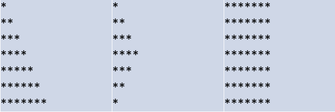

#### Exercise 1

Create a program that declares ```integer```, ```float``` and ```double``` variables
- Find out how to assign maximum values for each variable (hint: use ```INT_MAX``` for integer, etc.)
- Print sizes and values of each variable
- Discuss the results

Note: use tutorial as your primary reference


#### Solution 1

```INT_MAX, FLT_MAX, DBL_MAX``` - predefined constants from ```limits.h``` library.

```
#include <stdio.h>
#include <limits.h>
#include <float.h>

int main(int argc, char const *argv[])
{
	int a = INT_MAX;
	float b = FLT_MAX;
	double c = DBL_MAX;

	printf("Max int: %d, size: %ld bytes\n", a, sizeof(a));
	printf("Max float: %f, size: %ld bytes\n", b, sizeof(b));
	printf("Max double: %f, size: %ld bytes\n", c, sizeof(c));

	return 0;
}
```

---

#### Exercise 2

Write a program that prompts the user for a string, and prints its reverse.

Hints:
- a string in C is an **array** of chars (more about arrays next week)
- use ```strlen()``` function to get the **length** of a string
- you can use ```printf()```, ```puts()``` or even ```putchar()``` functions to print


#### Solution 2

```
#include <stdio.h>
#include <string.h>

int main()
{
	char a[100]; // allocate memory in stack for string
	scanf("%s", a); // read string from console

	// print in reverse order characters
	for (int i = strlen(a); i >= 0; i = i - 1)
		printf("%c", *(a + i));
	printf("\n");

	return 0;
}
```

---

#### Exercise 3

Write a function that outputs a right-side-up triangle of height ```n``` and width ```2n-1```. Your program must accept n as a command line parameter; the output for ```n = 6``` would be:

```
     *
    ***
   *****
  *******
 *********
***********
```

Hint: use ```sscanf()``` to convert ```string``` to ```int```


#### Solution 3

Example of executing the program: ```./some_file 6```

```
#include <stdio.h>
#include <stdlib.h>
int main(int argc, char const *argv[])
{
	int n;
	sscanf(argv[1], "%d", &n); // reading from argv n - number of stars

	for (int i = 1; i < n + 1; ++i)
	{
		for (int j = 1; j < i + 1; ++j)
		{
			printf("*");
		}
		printf("\n");
	}
	return 0;
}
```

---

#### Exercise 4

Write a program that asks user to input two integers and swaps them using a separate function.
Hint: you will need to pass parameters by reference (by pointer I think he meant).


#### Solution 4

```
#include <stdio.h>

// Custom implementation of swap function, that inputs 2 pointers
void _swap(int* a, int* b)
{
	int c = *a;
	*a = *b;
	*b = c;
}

int main(int argc, char const *argv[])
{
	printf("Enter 2 numbers: ");
	int a, b;
	scanf("%d %d", &a, &b); // reading 2 int numbers

	_swap(&a, &b); // pass ptr to them in calling function

	printf("Output: %d %d\n", a, b); // outputting numbers

	return 0;
} 
```

---

#### Exercise 5

Add several functions to your ```ex3.c``` file, so user could print different figures on his choice; examples are:




#### Solution 5

To be added


