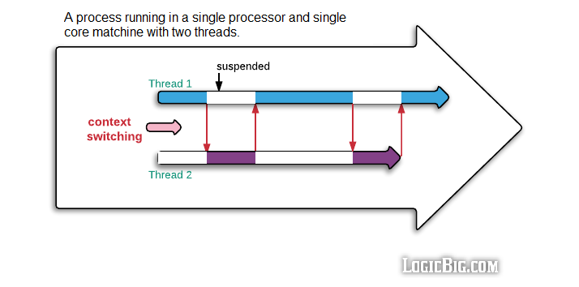

####  Task 1

Consider a system that has four CPUs, each CPU having two threads (hyperthreading). Suppose six programs, P0, P1, P2, P3, P4 and P5 are started with run times of 5, 10, 15, 5, 10 and 10 msec, respectively. Which is the minimum time in milliseconds that is needed to execute these programs?


Select one:
- ```30```
- ```25```
-  ```20```
- ```15``` <- **Correct**
-  ```7.5```


Solution: 4 cores, 8 threads:
- 5 and 10 ms. for 1 core;
- 15 for 2 ms. core;
- 5 and 10 ms. for 3 core;
- 10 for 4 ms. core.

Please notice that threads executing in cores **sequentially**, not in parallel - there is context switch, that fastly changes threads, but still threads execute one by one.



---

####  Task 2

PSW register stands for ____________. Select one:
- ```Process status word register```
- ```Pipeline status word register```
- ```Processor status word register```
- ```Program status word register``` <- **Correct**

[What is PSW?](https://en.wikipedia.org/wiki/Status_register)


---

####  Task 3

The software that talks to a controller, giving it commands and accepting responses is called _______________.
Select one:
- ```Supervisor```
- ```Device driver``` <- **Correct**
- ```BIOS```
- ```Interrupt vector```


---

####  Task 4


Some ways to do input and output (I/O operations) are (select one or more):
- ```by making program directly send a flow of bits to a device which converts these bits into understandable commands```
- ```by using the special DMA chip ``` <- **Correct**
- ```a user program issues a special system call which is translated to a procedure call to the driver ``` <- **Correct**
- ```by installing special software into BIOS```
- ```driver starts the device and asks it to give an interrupt when it is finished``` <- **Correct**

The solution to be added

---

####  Task 5

Which of the below are **not** buses?
Select one or more:

- ```USB``` <- Bus
- ```PSW``` <- **Correct**, PSW - program status word
- ```DMA``` <- **Correct**, DMA(direct memory access) - chip that handles I/O
- ```IOS``` <- **Correct**, IOS - operating system
- ```PCI``` <- Bus
- ```SATA``` <- Bus, SATA connects hard drives with motherboard
- ```DMI``` <- Bus, DMI - Direct Media Interface (DMI) is Intel's proprietary link between the north bridge and south bridge on a computer motherboard.
- ```PCI3``` <- Bus
- ```PCIe``` <- Also bus
- ```BIOS``` <- **Correct**, Basic Input/Output System
- ```PROM``` <- **Correct**, Programmable Read-Only Memory

---

####  Task 6

If multiple devices finish while interrupts are disabled, the ______________ decides which one to let through first, usually based on static priorities assigned to each device.
Select one:

- ```Device driver```
- ```Device controller```
- ```Disk controller```
- ```Interrupt controller ``` <- **Correct**

Interrupt controller deals with handling interrupts from devices.


[What is Interrupt controller?](https://doc.micrium.com/display/os305/Handling+CPU+Interrupts)

---

####  Task 7

Once the CPU has decided to take the interrupt, __(this)__ and __(this)__ are typically then pushed onto the current stack and the CPU switched into kernel mode.
Select one or more:
- ```the PSW ``` <- **Correct**
- ```the interrupt vector```
- ```the program counter ``` <- **Correct**
- ```the heap```
- ```the PCI```

All registers of process should be saved, that's why **PSW** and **PC** should be pushed into stack.
