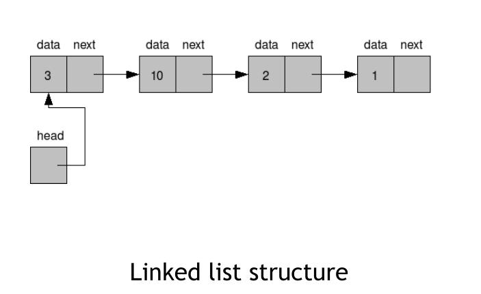

#### Exercise 1

Compile and run the following program:
```c
#include <stdio.h>
int main(){
	int* pc;
	int c;
	c=22;

	printf("Address of c:%d\n",&c);
	printf("Value of c:%d\n\n",c);

	pc=&c;

	printf("Address of pointer pc:%d\n",pc);
	printf("Content of pointer pc:%d\n\n",*pc);

	c=11;

	printf("Address of pointer pc:%d\n",pc);
	printf("Content of pointer pc:%d\n\n",*pc);

	*pc=2;

	printf("Address of c:%d\n",&c);
	printf("Value of c:%d\n\n",c);
	return 0;
}
```


  

#### Solution 1


To be added

---

#### Exercise 2

Write a function bubble_sort() which will accept an array of integers and sort it in place using Bubble sort* algorithm


#### Solution 2


```c
#include <stdio.h>

// function of sorting,, which inputs an array and its size
void bubble_sort(int* a, int size) {
	for (int i = 0; i < size; ++i)
	{
		// here algo could be optimized, we don't need n**2 steps, but only 0.5*n**2
		for (int j = 1; j < size; ++j)
		{
			// if prev. element greater that this one => swap them
			if (a[j - 1] > a[j])
			{
				int t = a[j - 1];
				a[j - 1] = a[j];
				a[j] = t;
			}
		}
	}
}

int main() {
	int a[13] = {1, 5, 2, 8, 1, 9, 9, 5, 0, 7, 2, 4, 5};
	bubble_sort(a, 13);

	for (int i = 0; i < 13; ++i) {
		printf("%d ", a[i]);
	}
	printf("\n");
}
```

---

#### Exercise 3

 Write a program that creates a **linked list** containing integers and uses the next functions:
- a function ```print_list()``` that will print out the value of each element
- a function ```insert_node()``` which will insert a new
element after some existing element
- a function ```delete_node()``` which will delete a certain element




  

#### Solution 3

In my implementation I created a single linked list - he has empty (NULL) head and tail and head points to tail.

```c
#include <stdio.h>
#include <stdlib.h>

// Container for storing element
struct Node {
	// ptr to the next node (element)
	struct Node* next;
	int value;
};

// My list, I store head & tail & size of List
// We could optimize my implementation & don't store size of snake
struct List {
	struct Node* head;
	struct Node* tail;
	int size;
};


void print_list(struct List* list) {
	struct Node* current = list->head;

	while (current->next != list->tail) {
		current = current->next;
		printf("%d ", current->value);
	}
	printf("\n");
}

void insert(struct List* list, int val) {
	struct Node* current = list->head;
    list->size++;

	while (current->next != list->tail) {
		current = current->next;
	}

	struct Node* node = (struct Node*)malloc(sizeof(struct Node*));
	node->value = val;
	node->next = list->tail;
	current->next = node;
}

void delete_node(struct List* list, int val) {
	struct Node* current = list->head;
	list->size--;

	while (current->next != list->tail) {

		if (current->next->value == val) {
			struct Node* tmp = current->next;

			current->next = current->next->next;
			free(tmp);
			return;
		}
		current = current->next;
	}
}


int main() {
	struct List* list = (struct List*)malloc(sizeof(struct List*));
	list->size = 0;
	list->head = (struct Node*)malloc(sizeof(struct Node*));
	list->tail = (struct Node*)malloc(sizeof(struct Node*));
	list->head->next = list->tail;


	print_list(list);

	insert(list, 3);
	insert(list, 2);
	insert(list, 9);
	insert(list, 7);
	insert(list, 5);
	insert(list, 2);
	print_list(list);
	delete_node(list, 9);
	print_list(list);
	insert(list, 5);
	insert(list, 2);
	print_list(list);

}
```

---

#### Exercise 4

Implement a **Quicksort** algorithm:
- Pick an element, called a pivot, from the array
- Partitioning: reorder the array so that all elements with values less than the pivot come before the pivot, while all elements with values greater than the pivot come after it
(equal values can go either way). After this partitioning, the
pivot is in its final position. This is called the partition
operation
- Recursively apply the above steps to the sub-array of
elements with smaller values and separately to the sub-array
of elements with greater values


  

#### Solution 4

Comments to be added
```
#include <stdio.h>


void swap(int *pInt, int i, int j) {
    int temp = pInt[i];
    pInt[i] = pInt[j];
    pInt[j] = temp;
}

int partition(int *array, int low, int high) {
    int pivot = array[high];
    int i = low - 1;

    for (int j = low; j <= high - 1; ++j) {
        if (array[j] < pivot) {
            i++;
            swap(array, i, j);
        }
    }
    swap(array, i + 1, high);

    return i + 1;
}

void qsort(int* array, int low, int high) {
    if (low < high) {
        int pi = partition(array, low, high);

        qsort(array, low, pi - 1);
        qsort(array, pi + 1, high);
    }
}


int main() {
    int array[10] = {1, 6, 4, 3, 9, 8, 8, 7, 5, 6};
    int size = 10;
    qsort(array, 0, size - 1);

    for (int i = 0; i < size; ++i) {
        printf("%d ", array[i]);
    }
}
```

---

#### Exercise 5

Change your linked list implementation to a **doubly linked list**


#### Solution 5

Comments to be added.

```c
#include <stdio.h>
#include <stdlib.h>
#include <assert.h>

struct Node {
    struct Node *prev, *next;
    int value;
};

struct List {
    struct Node *head, *tail;
    int size;
};


void print_list(struct List* list) {
    struct Node* current = list->head;

    while (current->next != list->tail) {
        current = current->next;
        printf("%d ", current->value);
    }
    printf("\n");
}

void insert(struct List* list, int val) {
    struct Node* current = list->head;
    list->size++;

    while (current->next != list->tail) {
        current = current->next;
    }

    struct Node* node = (struct Node*)malloc(sizeof(struct Node*));
    node->value = val;
    node->next = list->tail;
    current->next = node;
    node->prev = current;
    list->tail->prev = node;

    list->size += 1;
}

void delete(struct List* list, int val) {
    struct Node* current = list->head;
    list->size--;

    while (current->next != list->tail) {

        if (current->next->value == val) {
            struct Node* tmp = current->next;

            current->next = current->next->next;
            current->next->prev = current;
            free(tmp);
            return;
        }
        current = current->next;
    }
}

int main() {
    struct List* list = (struct List*)malloc(sizeof(struct List*));
    list->size = 0;
    list->head = (struct Node*)malloc(sizeof(struct Node*));
    list->tail = (struct Node*)malloc(sizeof(struct Node*));
    list->head->next = list->tail;
    list->tail->prev = list->head;

    assert(list != NULL && list->head != NULL && list->tail != NULL);

    print_list(list);

    int values[5] = {4, 6, 2, 8, 9};
    for (int i = 0 ; i < sizeof(values) / sizeof(int); ++i) {
        insert(list, values[i]);
    }

    print_list(list);

    delete(list, 6);
    print_list(list);
    for (int i = 0 ; i < sizeof(values) / sizeof(int); ++i) {
        insert(list, values[i]);
    }
    print_list(list);

}
```
