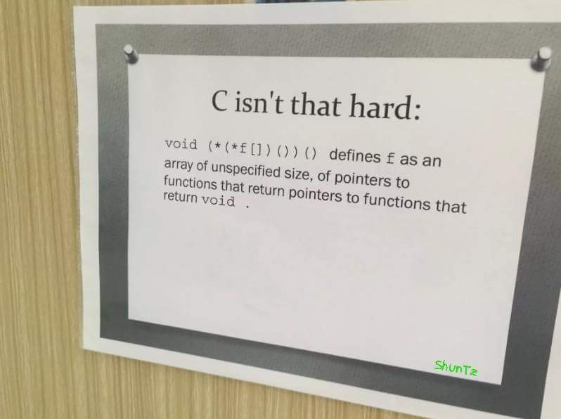

#### Task 1

## INCORRECT QUESTION, ATTENTION!!!!
```c
#include <stdio.h>
const int a = 12;
int * b = &a;       //1
int c = a;          //2

int main () {
  printf ("%d %d %d", a, *b, c+*b);
  return 0;
}
```

Select one:
- ```Compilation error at point //1```
- ```Prints 12 12 24 ```
- ```Runtime error```
- ```Compilation error at point //2```

  
---

#### Task 2

Should not be hard, refer to tutorial slides.



Match the definitions with the code:
- Pointer to an integer: ```int *a;```
- Integer:```int a;```
- Pointer to a function that gets and integer as an argument and returns an integer: ```int (*a)(int);```
- Pointer to an array of 10 integers: ```int (*a)[10];```
- Array of integers: ```int a[10];```
- Array of 10 pointers to a function that accepts an integer as an argument and returns an integer: ```int (*a[10])(int);```
- Array of 10 pointers to integers: ```int *a[10];```
- Pointer to a pointer to an integer: ```int** a;```

---

#### Task 3

Choose the correct definition of a function that accepts ```int Array[10][20]``` as an argument, select one:
- ```void func(int &argument);```
- ```void func(int argument[][]);```
- ```void func(int * argument);```
- ```void func(int argument[][20]); ``` <- **Correct**
- ```void func(int ** argument);```

[Passing a 2D array to a C++ function](https://stackoverflow.com/questions/8767166/passing-a-2d-array-to-a-c-function)


---

#### Task 4

Which of the following lines have errors?

```c
#include <stdio.h>

int main() {
  if (0)  // 1
    if (1)  // 2
      for(;;)  // 3
        while (1);  // 4
    else printf("foo");  // 5
  else printf("bar");  // 6

  return 0;
}
```


Select one:
- ```None of the lines have an error``` <- **Correct**
- ```//3```
- ```//6```
- ```//1```
- ```//2```
- ```//4```
- ```//5```

Comments will be added.

---

#### Task 5

Which of the following fundamental C types are architecture-independent and have the same representation on every platform? Select one:
- ```double```
- ```int```
- ```float```
- ```unsigned int```
- ```None of them ``` <- **Correct**
- ```unsigned long```
- ```long```


> The sizes of types in C are dependent on the decisions of compiler writers, subject to the requirements of the standard.
> The decisions of compiler writers tend to be strongly influenced by the CPU architecture.

[Type sizes in C](https://stackoverflow.com/questions/11380709/does-the-size-of-the-integer-or-any-other-data-types-in-c-dependent-on-the-under#:~:text=The%20sizes%20of%20types%20in,influenced%20by%20the%20CPU%20architecture.)

---

#### Task 6

If a variable is a **pointer to a structure**, then which of the following operator is used to **access data members** of the structure through the pointer variable? Select one:
- ```*```
- ```.```
- ```&```
- ```->``` <- **Correct**

[Arrow operator (->) usage in C](https://stackoverflow.com/questions/2575048/arrow-operator-usage-in-c)


---

#### Task 7

What will the SWAP macro in the following program be expanded to on preprocessing? Will the code compile?

```c
#include <stdio.h>
#define SWAP(a, b, c)(c t; t=a, a=b, b=t)
int main()
{
    int x=10, y=20;
    SWAP(x, y, int);
    printf("%d %d\n", x, y);
    return 0;
}
```

Select one:
- ```Compiles with a warning ```
- ```Will not compile ``` <- **Correct**
- ```Compiles and print nothing```
- ```Compiles```

Explanation will be added.

---

#### Task 8

What will happen if in a C program you assign a value to an array element whose subscript **exceeds** the size of array?
Select one:
- ```The program may crash if some important data gets overwritten ``` <- **Correct**, segfault could happen in some cases
- ```The array size would appropriately grow.```
- ```The element will be set to 0.```
- ```The compiler would report an error.```
