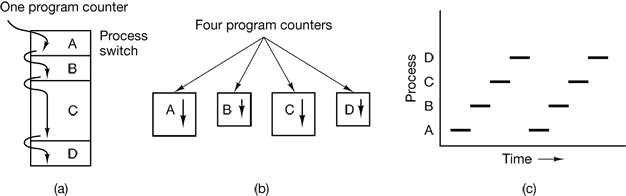
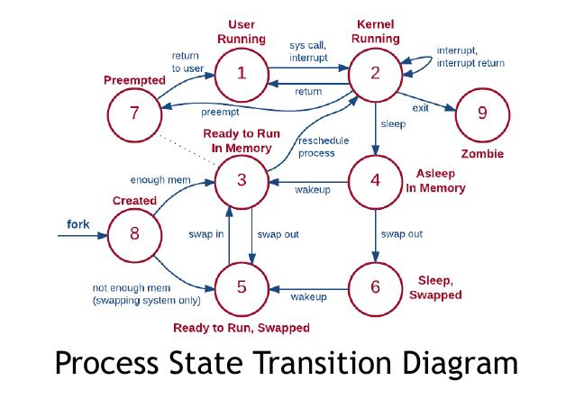
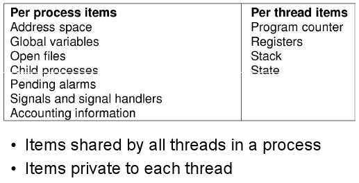

#### Task 1

Select all statements that are correct
Select one or more:
- ```Multiple processes can be executed on the same single-core processor at a time ``` <- At one time only one process is executing at one core
- ```Operating system can only have a number of processes less or equal to the number of processor cores``` <- _Bullshit_
- ```Multiple processors can execute the same process at a time ``` <- **Correct**



---

#### Task 2


A UNIX Process, that stays in the background and handles activities such as email, printing etc. is called

Select one:
- ```Daemon ``` <- **Correct**
- ```Driver```
- ```Thread```
- ```Service```

---

#### Task 3

A system call to create a new process in UNIX is

Select one:
-  ```process()```
- ```fork() ``` <- **Correct**
- ```exec()```
- ```init()```

[Man fork](https://www.man7.org/linux/man-pages/man2/fork.2.html)

---

#### Task 4

What is the name of the root process in UNIX operating system? Select one:
- ```su```
- ```init``` <- **Correct**
- ```root```
- ```parent```

[Init process](https://en.wikipedia.org/wiki/Init)

---

#### Task 5

Which of the following are not process states in UNIX? Select one or more:
- ```User running```
- ```Zombie```
- ```Kernel running```
- ```Preempted```
- ```Blocked ``` <- **Correct**
- ```System running ``` <- **Correct**
- ```Killed ``` <- **Correct**



---

#### Task 6

What is the purpose of ```exec()``` system call? Select one:
- ```To execute a program specified by input parameters in a new process```
- ```To stop execution of a process specified by input parameters```
- ```To create a copy of the currently running process```
- ```To replace the address space of a process with the address space of another process, specified by input parameters ``` <- **Correct**

Explanation will be added!

---

#### Task 7

An operating system component, responsible for changing processes states and planning processor time is called

Select one:
- ```Process manager```
- ```Scheduler``` <- **Correct**
- ```IPC```
- ```Kernel```

> In computing, scheduling is the method by which work is assigned to resources that complete the work. The work may be virtual computation elements such as threads, processes or data flows, which are in turn scheduled onto hardware resources such as processors, network links or expansion cards.

[Scheduling](https://en.wikipedia.org/wiki/Scheduling_(computing))

---

#### Task 8

Which of the following statements are true? Select all that apply
- ```Multiple threads can share the same global variable``` <- **Correct**
- ```Every thread can access every memory address within its process’ address space``` <- **Correct**
- ```Multiple processes can belong to the same thread```
- ```Multiple threads can belong to the same process``` <- **Correct**
- ```Multiple threads can share the same address space without any explicit action from the developer ``` <- **Correct**
- ```Multiple processes can share the same address space without any explicit action from the developer```

Explanation will be added!

---

#### Task 9

Which of the following are unique (not shared) for each thread within the process? Select all that apply

- ```Stack``` <- **Correct**
- ```Address space```
- ```Signal handlers```
- ```Open files```
- ```Registers``` <- **Correct**
- ```Program counter ``` <- **Correct**
- ```Global variables```



#### Task 10

What is the name of the standard for writing portable multithreaded application in UNIX? Select one:
- ```POSIX threads```
- ```ANSI```
- ```Java threads```
- ```pthreads ``` <- **Correct**
- ```gnuthreads```

You should know it from school!

