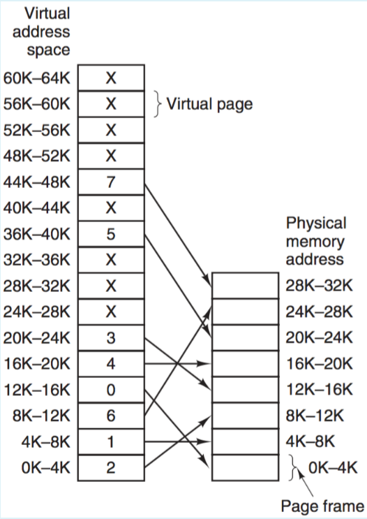
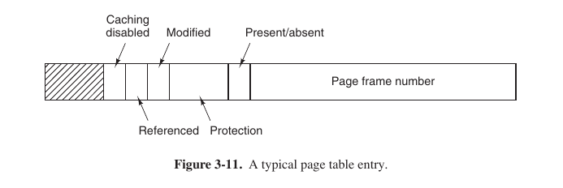

#### Task 1

Virtual memory is (select one):
- ```...large secondary memory```
- ```...large main memory```
- ```...an illusion of large main memory ``` <- **Correct**
- ```...none of the above```

> In computing, virtual memory is a memory management technique that provides an "idealized abstraction of the storage resources that are actually available on a given machine" which "creates the illusion to users of a **very large** (main) memory".

[Virtual memory](https://en.wikipedia.org/wiki/Virtual_memory)

#### Task 2

Page fault occurs when... (select one):
- ```...a requested page is in memory```
- ```...a requested page is not in memory ``` <- **Correct**
- ```...an exception is thrown```
- ```...a page is corrupted```


Types of page fault: 
1. When page is not in TLB, but in page table (soft miss).
2. When page is neither in TLB nor in page table (hard miss).
3. Illegal access (Segmentation fault)
4. Permissions does not match (page has ```r w```, but we want to ```e```)
5. Page is taken by another process (need to refresh TLB and Page table).

Tanenbaum, 200-205 page

 ## Why we use TLB, if page table walk takes ```O(1)```?

- Page table stored in Main memory (RAM), and to access it, we need twice access the main memory (first to convert virtual address to phys. address), them to get content of page frame, which is slow.
- TLB is hardware thing, which is not storing in RAM and very fastly convert addresses. So, in this case we need to have only 1 access to main memory to get the page, which is faster.

#### Task 3

Using the page table below, give the physical address corresponding to each of the following virtual addresses: ```2020, 4200, 9999```




Select one or more:
- ```4200 ``` <- **Correct**
- ```10212``` <- **Correct**
- ```1807```
- ```20020```
- ```4000```
- ```2020```
- ```26383 ``` <- **Correct**
- ```42```

```0*1024 < 2020 < 4*1024 => 2020 correspond to 8K...12K physical addresses.```

```2020 + 8*1024 = 10212 (ph.address)```

Others should be calculated the same way.


#### Task 4

Which of the following statements about the first fit and the next fit algorithms are true?

Select one or more:
- ```The next fit algorithm is generally faster than the first fit algorithm```
- ```The first fit algorithm always scans for a hole starting from the beginning of the list of segments``` <- **Correct**
- ```The next fit algorithm always looks for a second available hole```
- ```The first fit algorithm is generally faster than the next fit algorithm ``` <- **Correct** 
- ```The next fit algorithm is also called quick fit```


> The simplest algorithm is first fit. The memory manager scans along the list of segments until it finds a hole that is big enough. The hole is then broken up into two pieces, one for the process and one for the unused memory, except in the statistically unlikely case of an exact fit. First fit is a fast algorithm because it searches as little as possible.

> A minor variation of first fit is next fit. It works the same way as first fit, except that it keeps track of where it is whenever it finds a suitable hole. The next time it is called to find a hole, it starts searching the list from the place where it left off last time, instead of always at the beginning, as first fit does. Simulations by Bays (1977) show that next fit gives slightly worse performance than first fit.

Tanenbaum, 192


#### Task 5

Which of the following are **not** memory management algorithms according to Tannenbaum?

Select one or more:
- ```Proper fit ``` <- **Correct** 
- ```Best fit```
- ```Worst fit```
- ```Last fit``` <- **Correct** 
- ```Random fit ``` <- **Correct** 
- ```Quick fit``` 
- ```Crazy fit ``` <- **Correct** 
- ```Next fit```


Tanenbaum, 192-193

#### Task 6

Increasing the RAM of a computer typically improves performance because: Select one or more:
- ```Virtual memory increases``` <- No whatsoever, size of virt. memory is architecture-specific
- ```Fewer segmentation faults occur``` <- Nope, segfault - illegal addresses, mistakes in program
- ```Larger RAMs are faster``` <- No, obviously
- ```Fewer page faults occur ``` <- **Correct** 

Larger RAM - more page frames, more pages we could give to processes, lower PFF (page fault frequency)

Tanenbaum, 224

#### Task 7

A computer system supports 32-bit virtual addresses as well as 32-bit physical addresses. Since the virtual address space is of the same size as the physical address space, the OS designers decide to **get rid of the virtual memory** entirely. Which one of the following is true (choose the best option)?

Select one:
- ```The chipset will no longer require MMU``` <- **Correct**, no virtual memory - no need to convert VA to PA - we don't need MMU.
- ```Efficient implementation of multi-user support is no longer possible``` <- _Bullshit_
- ```The processor cache organization can be made more efficient now``` <- That's a trap! (idk how to comment it :P)
- ```CPU scheduling can be made more efficient now ``` <- Scheduling is more about choosing process, not about memory

#### Task 8

Consider a swapping system in which memory consists of the following hole sizes in memory order: ```10 MB, 4 MB, 30 MB, 18 MB, 7 MB, 9 MB, 12 MB, and 15 MB```. Which holes are taken for successive segment requests of ```12 MB, 10 MB``` and ```9 MB``` for **worst** fit?
Select one or more:
- ```4 MB```
- ```30 MB ``` <- **Correct**
- ```10 MB```
- ```15 MB ```
- ```9 MB```
- ```12 MB```
- ```7 MB```
- ```18 MB``` <- **Correct**

Explanation will be added!

#### Task 9


Compute the virtual page number and offset for a 4-KB page for virtual address 25000.
Select one or more:
- ```Offset is 250```
- ```Virtual page number is 0```
- ```Offset is 424```  <- **Correct**
- ```Virtual page number is 6 ```  <- **Correct**
- ```Offset is 42```
- ```Virtual page number is 3```
- ```Virtual page number is 1```
- ```Offset is 8616```

```
4 kB = 2**2 * 2**10 bytes = 2**12 bytes => 12 bits for offset
bin(25000) = '0b110(virt page number)_000110101000(offset)'
int('0b110', 2) = 6 (# page)
int('0b000110101000', 2) = 424 (# offset address)
```

##  Why we convert 4 kB into bytes but not in bits?

- Because in RAM the memory is separated into **words (1 byte)**, but not in bits and we could access RAM only by reading words. 

#### Task 10

The essential content(s) in each entry of a page table are: 
- ```Access right information ```
- ```The time when it was last referenced```
- ```Virtual page number```
- ```Memory offset```
- ```R and M bits``` 
- ```Page frame number ``` <- **Correct**

> In Fig. 3-11 we present a sample page table entry. The size varies from computer to computer, but 32 bits is a common size. The most important field is the Page frame number...

Other fields are also important, but prof. thinks in another way ;) 

