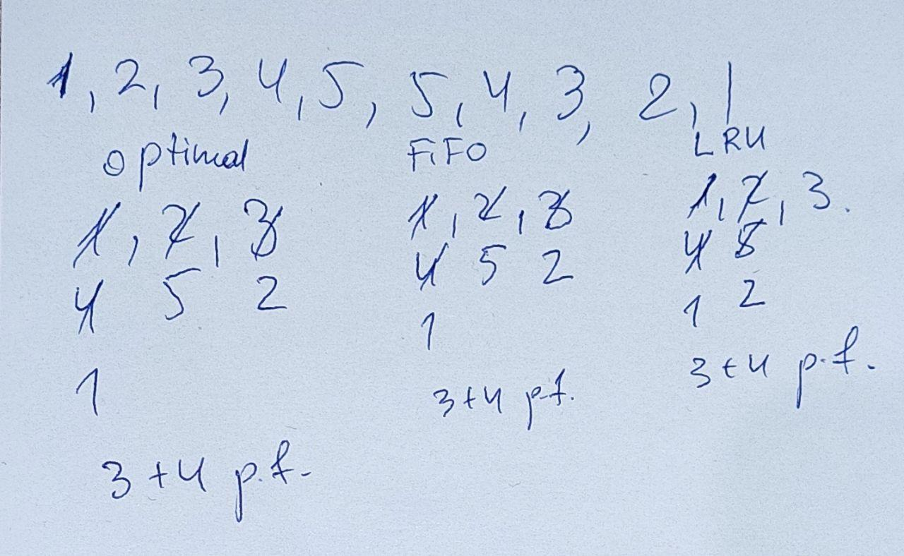

#### Task 1

A process has been allocated 3 page frames and no pages of the process are initially available in the memory. The process references pages as follows: ```3, 5, 4, 6, 1, 3, 1, 4, 5, 3 ```

If Optimal page replacement algorithm is used, how many page faults will occur?

Select one:
- ```9```
- ```5```
- ```7```
- ```4```
- ```3```
- ```8```
- ```6``` <- **Correct**

> The optimal page replacement algorithm says that the page with the highest label should be removed. If one page will not be used for 8 million instructions and another page will not be used for 6 million instructions, removing the former pushes the page fault that will fetch it back as far into the future as possible. Computers, like people, try to put off unpleasant events for as long as they can.

Firstly, we have 3 page faults (to fill page frames), now in memory: ```3, 5, 4```.
Then, we want to add 6 (+1 page fault): page 3 will be referenced at 3-th access, page 5 - at 6-th access, page 4 - at 5-th access => so we drop page 5, now in memory: ```3, 6, 4```. And so on ;)

#### Task 2

A process has been allocated 3 page frames and no pages of the process are initially available in the memory. The process references pages as follows: 

```3, 5, 4, 6, 1, 3, 1, 4, 5, 3```

How many more page faults occur with FIFO than with the Optimal page replacement algorithm?

Select one:
- ```3```
- ```2``` <- **Correct**
- ```0```
- ```4```
- ```1```

FIFO: we store only 3 pages, and when page is not in TLB, we drop page with lowest load time (earlier added in queue).
First 3 page faults, now in memory: ```3, 5, 4```.
Then ```6``` came(-1 page fault): page```6``` not in TLB, page ```3``` has lowest load time (earliest come) => we drop ```3``` and in this place put ```6```. And so on...

So we get 8 page faults in FIFO and 6 page faults in optimal => answer is ```2```.


#### Task 3

Consider the page reference string ```1, 2, 3, 4, 5, 5, 4, 3, 2, 1```. A computer system has main memory size of 3 page frames which are initially empty. Let LRU, FIFO and OPTIMAL denote the number of page faults when the corresponding page replacements algorithm is used. Then

Select one or more:
- ```OPTIMAL < LRU < FIFO```
- ```OPTIMAL < FIFO < LRU```
- ```OPTIMAL = LRU ``` <- **Correct**
- ```OPTIMAL = FIFO - 2``` 
- ```OPTIMAL = FIFO ``` <- **Correct**



#### Task 4

We have a physical memory of ```20``` page frames that contain pages numbered ```100..119```. Our program will access the pages in the following order: ```1,2,3,4...100``` and this will be repeated 5 times. What number of page faults will occur if we use optimal page replacement algorithm
Select one:
- ```420```
- ```499```
- ```500```
- ```419 ``` <- **Correct**
- ```421```


idk how to do this.

#### Task 5

A computer has four page frames. The time of loading, time of last access, and the R and M bits for each page are as shown below (the times are in clock ticks):

### Page Table

|Page|Loaded|Last referenced|R|M|
|---|---|---|---|---|
|0|126|280|1|0|
1|230|265|0|1|
2|140|270|0|0|
3|110|285|1|1|

Which page will LRU replace? Select one:
- ```3```
- ```2``` <- **Correct**
- ```1```
- ```0```

Least recently used delete page with smallest last reference time - so, it will delete page 2.

#### Task 6

Which of the following is/are not a form of memory?
Select one or more:
- ```Instruction register``` <- Memory, like general registers
- ```TLB``` <- Memory, stores page mappings
- ```Instruction cache``` <- Memory obviously
- ```Instruction opcode ``` <- **Correct**

> In computing, an opcode (abbreviated from operation code, also known as instruction machine code, instruction code, instruction syllable, instruction parcel or opstring) is the portion of a machine language instruction that specifies the operation to be performed.

Opcode = instruction (```mov, add```, ...) in machine code.

#### Task 7

Which of the following statements are true?

Select one or more:
- ```The Optimal page replacement algorithm will select the page that has been used most number of times``` <- False, Optimal page select page that greatest usage time next. 
- ```The Optimal page replacement algorithm is impossible to implement ``` <- **Correct**
- ```The work of the Clock algorithm is based on inspection of R bit ``` <- **Correct**, if ```R = 0``` then drop page.
- ```The Optimal page replacement algorithm will select the page that will not be used for the longest time in the future ``` <- **Correct**
- ```Second-Chance Algorithm is an improvement over LRU algorithm```<- Second-chance algo is improvement on FIFO
- ```The work of the Clock algorithm is based on inspection of M bit``` <- Bullshit

#### Task 8

Which of the following statements are **false**?

Select one or more:
- ```Small pages increase internal fragmentation``` <- **Bullshit**, small pages - more effective usage of space (pages are 50% filled approx.)
- ```Small pages help allocating space for multiphase programs with less memory wasted``` <- ```Idk really```
- ```Having many pages leads to a large page table``` <- Right, more pages - more entries in page table
- ```Transferring a small page takes significantly less time then transferring a large page``` <- **Not correct**
- ```Using small pages saves space in the TLB``` <- **Bullshit**, small pages - more entries, less address space could be stored in TLB


#### Task 9

A student has claimed that ‘‘in the abstract, the basic page replacement algorithms (FIFO, LRU, optimal) are identical except for the attribute used for selecting the page to be replaced’’. What is that attribute for the FIFO algorithm? LRU algorithm? Optimal algorithm? Select all that apply.
Select one or more:
- ```Nearest reference time in the future for Optimal``` <- **Correct**
- ```Nearest load time for Optimal```
- ```Page class for FIFO```
- ```Load time for FIFO``` <- **Correct**
- ```Amount of page frames for LRU```
- ```Latest reference time for LRU``` <- **Correct**
 
In FIFO we need to know time when page came (load time); in LRU we have a counter with time of last access, optimal algorithm - when in the future this page will be referenced.

#### Task 10

Which of following statements is/are wrong for shared pages? 
Select one or more:
- ```Processes can share programs without using I- and D-spaces```
- ```Several processes sharing the same program can share its page tables```
- ```Approach, called copy on write, improves performance by reducing copying```
- ```After a fork system call copying of pages happens```

Idk how to answer it, help!!!

Moodle.com
