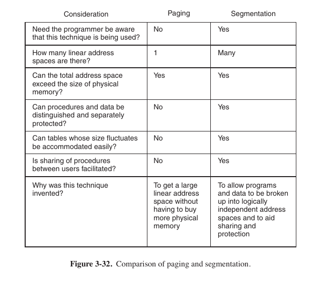
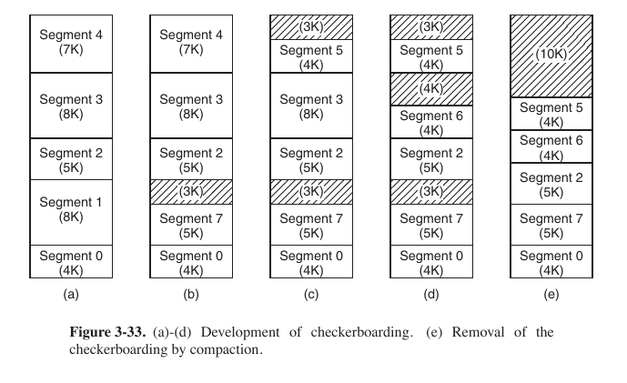
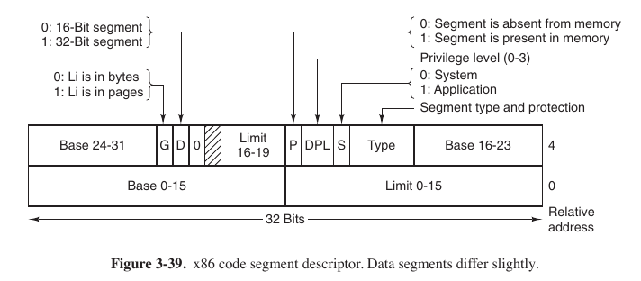
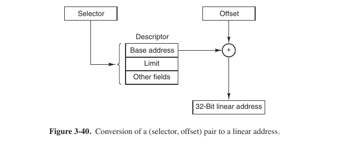

#### Task 1

The situation when only a part of a memory page is filled with data is called:

Select one:
- ```Checkerboarding```
- ```Segmentation```
- ```Pinning```
- ```Internal fragmentation ``` <- **Correct**
- ```External fragmentation```

> Determining the best page size requires balancing several competing factors. As a result, there is no overall optimum. To start with, two factors argue for a small page size. **A randomly chosen text, data, or stack segment will not fill an integral number of pages. On the average, half of the final page will be empty.** The extra space in that page is wasted. This wastage is called internal fragmentation. With n segments in memory and a page size of p bytes, np/2 bytes will be wasted on internal fragmentation. This reasoning argues for a small page size.

#### Task 2

Now we know what are the differences between paging and segmentation? Select all true statements that apply:

Select one or more:
- ```Both techniques allow programmer to share procedures between users``` <- **Correct**, idk
- ```When segmentation is used, total address space cannot exceed the size of physical address space```
- ```The total address space can exceed the size of physical memory for both techniques``` <- **Correct**, 
- ```Tables whose size fluctuates can be accommodated easily with segmentation``` <- **Correct**, segmentation is designed to accumulate growing tables.
- ```A programmer needs to be aware that paging is used as opposed to segmentation``` <- No, reverse

Can someone add comments here?




#### Task 3

Shifting the regions of memory allocated to processes, so that all the free memory forms one contiguous region is called:
Select one:
- ```Compaction```  <- **Correct**
- ```Swapping```
- ```Placement```
- ```Internal fragmentation```
- ```External fragmentation```



#### Task 4

Pinning is:

Select one:
- ```Locking pages engaged in I/O in memory ``` <- **Correct**
- ```Allocating a spacial page space on a disk```
- ```Reallocating memory pages to get rid of the consequences of internal fragmentation```
- ```Page fault handling```

> Pinning the pages in main memory is one way to ensure that **a process stays in main memory and is exempt from paging**. So, a real-time process must have the ability to pin the pages of its address space in memory, in order to guarantee immediate execution when triggered by an event, such as an interrupt. Real-time processes require deterministic timing, and paging can be a source of unexpected delays in program execution. Critical timing requirements can be thrown away if some portion of a real-time application has been previously paged out by the operating system. So, without pinning the pages in memory, valuable time may be spent retrieving pages.


#### Task 5

We consider a program which has the two segments shown below consisting of instructions in segment 0, and read/write data in segment 1. **Segment 0** has read/execute protection, and **segment 1** has just read/write protection. The memory system is a demand-paged virtual memory system with virtual addresses that have a 4-bit page number, and a 10-bit offset. The page tables and protection are as follows (all numbers in the table are in decimal):

| Segment 0    | Segment 1  |
| ------------ | ---------- |
| Read/Execute | Read/Write |

First two columns -> Segment 0, other 2 columns -> Segment 1

| Virtual Page # | Page frame # | Virtual Page # | Page frame # | 
| -------------- | ------------ | -------------- | ------------ | 
| 0              | 2            | 0              | On Disk      |     
| 1              | On Disk      | 1              | 14           |     
| 2              | 11           | 2              | 9            |     
| 3              | 5            | 3              | 6            |     
| 4              | On Disk      | 4              | On Disk      |     
| 5              | On Disk      | 5              | 13           |     
| 6              | 4            | 6              | 8            |  
| 7              | 3            | 7              | 12           | 

For the following case, either give the real memory address (page, offset) which results from dynamic address translation or identify the type of fault which occurs (either page or protection fault):
**```Store into segment 0, page 0, offset 16```**

Select one:
- ```Memory address (2, 16)```
- ```Protection fault: Jump to read/write segment ``` <- **Correct**
-  ```Protection fault: Write to read/execute segment```
- ```Page fault```

Store = write, segment 0 has only ```r e``` permissions, but not ```w``` => permission fault.


#### Task 6

We consider a program which has the two segments shown below consisting of instructions in segment 0, and read/write data in segment 1. Segment 0 has read/execute protection, and segment 1 has just read/write protection. The memory system is a demand-paged virtual memory system with virtual addresses that have a 4-bit page number, and a 10-bit offset. The page tables and protection are as follows (all numbers in the table are in decimal):

| Segment 0    | Segment 1  |
| ------------ | ---------- |
| Read/Execute | Read/Write |

First two columns -> Segment 0, other 2 columns -> Segment 1

| Virtual Page # | Page frame # | Virtual Page # | Page frame # |
| -------------- | ------------ | -------------- | ------------ |
| 0              | 2            | 0	 On Disk     |              |
| 1              | On Disk      | 1              | 14           |
| 2              | 11           | 2              | 9            |
| 3              | 5            | 3              | 6            |
| 4              | On Disk      | 4              | On Disk      |
| 5              | On Disk      | 5              | 13           |
| 6              | 4            | 6              | 8            |
| 7              | 3            | 7              | 12           |

For the following case, either give the real memory address (page, offset) which results from dynamic address translation or identify the type of fault which occurs (either page or protection fault):
**```Fetch from segment 1, page 4, offset 28```**

Select one:
- ```Protection fault: Write to read/execute segment```
- ```Memory address (4, 28)```
- ```Page fault ```
- ```Protection fault: Jump to read/write segment```

Fetch = retrieve (read), segment 1 has ```r```: page 4 is ```on Disk``` -> Page fault.


#### Task 7

An x86 segment descriptor contains:

Select one or more:
- ```A limit ``` <- **Correct**
- ```A peak```
- ```A base ``` <- **Correct**
- ```An offset```
- ```A selector```



#### Task 8

If paging is disabled, the segment base contains:

Select one:
- ```There is no correct answer```
- ```Starting logical address of the process```
- ```Segment length```
- ```Starting physical address of the segment in memory ``` <- **Correct**, obviously


#### Task 9


The segment limit contains:
Select one:
- ```Segment length ``` <- **Correct**, obviously
- ```Starting physical address of the segment in memory```
- ```Starting logical address of the process```
- ```There is no right answer```


#### Task 10

In regard to segmentation, a linear address  is:

Select one:
- ```A combination of segment's limit and an offset```
- ```A combination of segment's base and segment's limit```
- ```A combination of segment's base address and an offset ``` <- **Correct**

> Assuming that the segment is in memory and the offset is in range, the x86 then adds the 32-bit Base field in the descriptor to the offset to form what is called a linear address, as shown in Fig. 3-40. The Base field is broken up into three pieces and spread all over the descriptor for compatibility with the 286, in which the Base is only 24 bits. In effect, the Base field allows each segment to start at an arbitrary place within the 32-bit linear address space.



