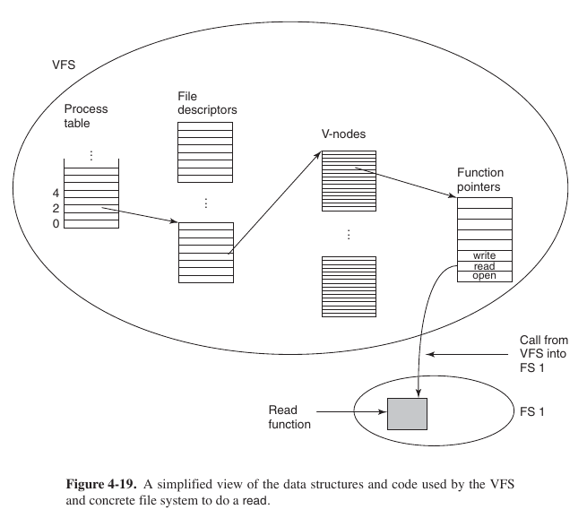
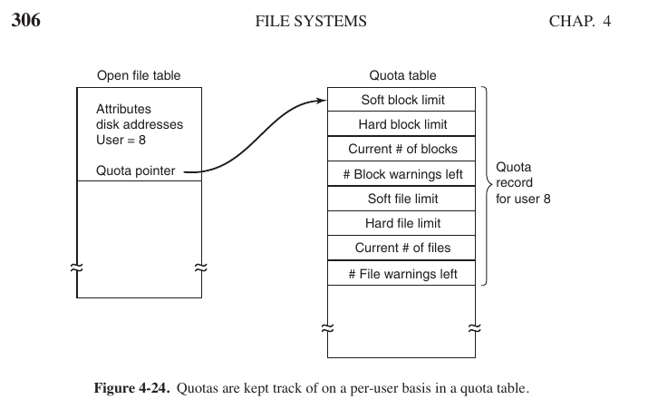
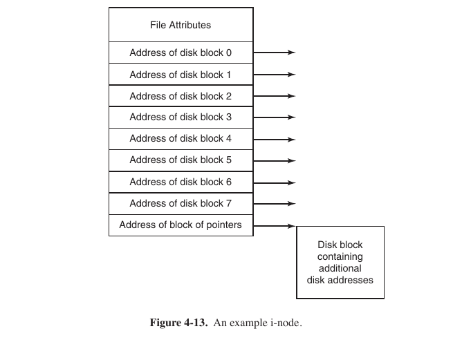
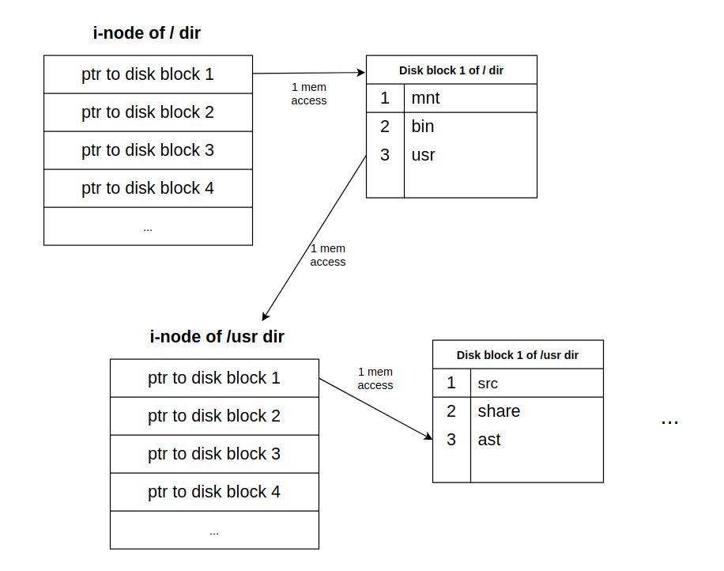

#### Task 1

Which of the following is TRUE about file extensions in UNIX
Select one:
- ```May or may not be enforced by the operating system, depends on flavor of Unix```
- ```File extensions are not enforced by the Operating system ``` <- **Correct**
- ```File extensions are always enforced by the operating system without user intervention```
- ```Creator/user of the file gives permission for handling file extensions to operating system by setting extension bit```
- ```A file extension depends on the value of file extension bit for user or operating system```

Extension is a part of file name, it is not stored in [i-node](https://ru.wikipedia.org/wiki/Inode), the extension in Unix is not obligatory.

#### Task 2

Which of the following is/are **FALSE** about path name conventions?
Select one or more:
- ```The absolute path name will always work, no matter what the working directory is.``` -. **True**
- ```If the first character of the path name is the separator, then the path is absolute.``` -> **True**
- ```The relative form of path does the same thing as absolute form of path.``` -> **True**
- ```".." refers to the current directory. ``` ->  **Nope**: ```.``` refers to current dir, ```..``` refers to upper dir
- ```If a process changes its working directory, then all other process are affected. ``` -> Idk

#### Task 3

Which of the following is/are **TRUE** about _symbolic link_?
Select one or more:
- ```Users with symbolic links to the file, just have i-node pointers and path names.``` <- **Nope**, i-node pointer is _hard link_
- ```There is no difference between a symbolic link and a hard link.``` <- **Nope**, obvoiusly
- ```Symbolic link cannot cross disk boundaries. ``` <- **Nope**, it could: only _hard link_ cannot cross partition boundaries (because i-node could match&collide).
- ```Removing a symbolic link does not affect the file at all.``` <- **True**
- ```Users who have linked to the file just have path names, not i-node pointers. ``` <- **True**

**What is Soft Link And Hard Link In Linux?**

A symbolic or soft link is an actual link to the original file, whereas a hard link is a mirror copy of the original file. If you delete the original file, the soft link has no value, because it points to a non-existent file. But in the case of hard link, it is entirely opposite. Even if you delete the original file, the hard link will still has the data of the original file. Because hard link acts as a mirror copy of the original file.

In a nutshell, a **soft link**

- ```can cross the file system```
- ```allows you to link between directories```
- ```has different inode number and file permissions than original file```
- ```permissions will not be updated```
- ```has only the path of the original file, not the contents```

A **hard link**

- ```can't cross the file system boundaries (i.e. A hardlink can only work on the same filesystem)```
- ```can't link directories```
- ```has the same inode number and permissions of original file```
- ```permissions will be updated if we change the permissions of source file```
- ```has the actual contents of original file, so that you still can view the contents, even if the original file moved or removed```

[Ref1](https://ostechnix.com/explaining-soft-link-and-hard-link-in-linux-with-examples), 
[Ref2](https://www.geeksforgeeks.org/difference-between-hard-link-and-soft-link)

#### Task 4

Which of the following is/are **FALSE** for virtual file systems? Select one or more:
- ```Most VFS implementations are essentially object oriented even if they are written in C rather than C++. ``` <- **False**
- ```The VFS has a lower interface to user processes and it is the POSIX interface. ``` <- **False**, it is upper interface for user processes
- ```The VFS has an upper interface to the concrete file systems. ``` <- **True**
- ```VFS involves creation of vnode. ``` <- **True**, obviously
- ```VFS has internal data structures such as mount table and an array of file descriptors to keep track of open files in the user processes. ``` <- **True**, vfs contains info about fd, open files, vnodes, table of pointers.

> Internally, most VFS implementations are essentially object-oriented, even if they are written in C rather than C++.

> In addition, the VFS has some internal data structures for its own use, including the mount table, and an array of file descriptors to keep track of all the open files in the user processes.

> Thus, the VFS has two distinct interfaces: the upper one to the user processes, and the lower one to the concrete file systems.

Tanenbaum, 296.



#### Task 5

Which of the following do **NOT** describe bitmap characteristics (prof. meant choose false statements)? Select one or more:

- ```Bitmap is a free space management technique.``` <- **True**
- ```Bitmap always requires less space than linked list model even when the disk is nearly full.``` <- **False**, when disk is nearly full LL requires O(1) space, while Bitmap - alpha * n
- ```A disk with n blocks requires a bitmap with size of n^2``` <- **False**, n blocks requires alpha * n
- ```Bitmap requires less space than linked lists, except when the disk is nearly full.``` <- idk
- ```Free blocks may be represented by 0's and allocated blocks may be represented by 1's in the map or vice versa.``` <- **True**, this is exactly how bitmaps works.

#### Task 6

Which of the following entries do **NOT** belong to a Quota table?
Select one:
- ```Number of file warnings left.```
- ```Block warnings left```
- ```Soft block limit.```
- ```Hard file limit.```
- ```Init process files ``` <- **Correct**

Just take a look on the picture.



Tanenbaum, 306.

#### Task 7

Removing a file (in UNIX operating system) involves following steps. Find the correct sequence of steps for this operation.
- ```Release the i-node to the pool of free i-nodes. ```
- ```Return all the disk blocks to the pool of free disk blocks. ```
- ```Remove the file from its directory.```

Select one:
- ```C, B, A```
- ```A, C, B```
- ```A, B, C```
- ```B, C, A```
- ```B, A, C```
- ```C, A, B```  <- **Correct**

Tanenbaum, 295.

#### Task 8

Select all options that are **TRUE** for UNIX operating system.
Select one or more:
- ```UNIX can have the following as 3 distinct file names such as maria, MARIA, Maria.``` <- **Correct**, unix is type-sensitive
- ```In UNIX, the size of the extension, if any, is up to the user, and a file may even have two or more extensions.``` <- **Correct**, e.x. linux archive has extension ```.tar.gz```
- ```UNIX allows only one extension with the file name``` 
- ```In UNIX, file extension such as homepage.html.zip is not a valid format```
- ```UNIX has a second file system known as resilient file system```

> Some file systems distinguish between upper- and lowercase letters, whereas  others do not. UNIX falls in the first category; the old MS-DOS falls in the second. (As an aside, while ancient, MS-DOS is still very widely used in embedded systems, so it is by no means obsolete.) Thus, a UNIX system can have all of the following as three distinct files: maria, Maria, and MARIA. In MS-DOS, all these names refer to the same file.

> Windows 8 all still support both FAT file systems, which are really obsolete now. However, these newer operating systems also have a much more advanced native file system (NTFS) that has different properties (such as file names in Unicode). In fact, there is second file system for Windows 8, known as ReFS (or Resilient File System), but it is targeted at the server version of Windows 8. 

Tanenbaum, 265.


#### Task 9

Which of the following options explains the behavior of the following program: 

```c
 #include <stdio.h> 
# include <sys/stat.h> 
# include <sys/types.h>

int main(int argc , char* argv[]) { 
 int ret; 
 ret = mkdir ("dir" , S_IRUSR | S_IRGRP | S_IROTH | S_IXGRP); 
 return 0; 
}
 ```


Select one:
- ```Deletes a directory with the name dir and all read, write and execute permissions.```
- ```Creates a directory named dir, giving read permission to the owner, group and others and an execute permission to the group. ``` <- **Correct**
- ```Creates a hard and a soft link to the directory named dir.```
- ```Creates a softlink and deletes a directory named dir with write and execute permissions to owner, group and others.```
- ```Deletes a softlink named dir and remove all permissions from owner, group and others.```

Comments about each permission bits:
 * ```S_IRUSR``` Read permission bit for the owner of the file.
 *  ```S_IRGRP```  Read permission bit for the group owner of the file.
 * ```S_IROTH``` Read permission bit for other users.
 * ```S_IXGRP``` Execute or search permission bit for the group owner of the file.

[The mode bits for access Premission](https://www.gnu.org/software/libc/manual/html_node/Permission-Bits.html)

#### Task 10

How many disk operations are needed to fetch the i-node for a file (handout.t) with the path name ```/usr/ast/courses/os/stds/handout.t```? Assume that the i-node for the root directory is in memory, but nothing else along the path is in memory. Also assume that all directories fit in one disk block.
Select one:
- ```12 ``` <- **Correct**
- ```9```
- ```8```
- ```10```
- ```11```

How to solve this kind of questions (how many disk operations ... to get some file from some path)?
- First, we need to keep in mind that i-node of directory does not store info about what files are stored in this directory - dir. stores only **file attributes** and **pointers to disk blocks**, and disk blocks are storing info about what is stored in dir. So, if we are in i-node and want to know what is in this folder we make 1 mem. access and then we need to make 1 more mem. access to get an i-node of child file.



