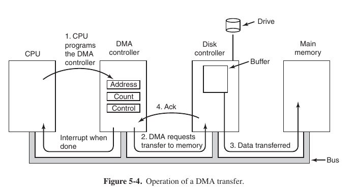
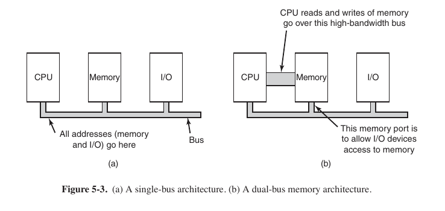
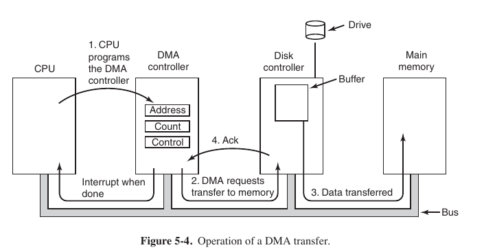

#### Task 1

Which of the following is an example of a **block device**?
Select one or more:
- ```Scanner```
- ```USB drive``` <- **Correct**
- ```Network interface```
- ```Printer```
- ```Hard disk``` <- **Correct**

> I/O devices can be roughly divided into two categories: block devices and character devices. A block device is one that stores information in fixed-size blocks, each one with its own address. Common block sizes range from 512 to 65,536 bytes. All transfers are in units of one or more entire (consecutive) blocks. The essential property of a block device is that it is possible to read or write each block independently of all the other ones. **Hard disks, Blu-ray discs, and USB sticks are common block devices**.

Tanenbaum, 338.

#### Task 2

What is a **device controller**? Mark the correct answer. Select one:
- ```An electronic component, typically in the form of a chip on the parentboard or an expansion circuit, used to handle device operations on hardware level ``` <- **Correct**
- ```Mechanical component within the device```
- ```Piece of software that provides device API to the operating system```

> I/O units often consist of a mechanical component and an electronic component. It is possible to separate the two portions to provide a more modular and general design. The electronic component is called the device controller or adapter. On personal computers, it often takes the form of a chip on the parentboard or a printed circuit card that can be inserted into a (PCIe) expansion slot. The mechanical component is the device itself. 



339, 5.1.2

#### Task 3

Which of the following is **NOT** a standard approach of communication between the operating system and the device controller? Select one:
- ```Creating a pipe between the file that represents a device and the STDIN/STDOUT ``` <- **Correct**
- ```Memory-mapped IO```
- ```Assigning I/O ports to each device controller register```

There are 3 ways of communication with the devices (& device controllers):
- Programmed I/O (polling or busy waiting) 
> The user process then acquires the printer for writing by making a system call to open it. If the printer is currently in use by another process, this call will fail and return an error code or will block until the printer is available, depending on the operating system and the parameters of the call. Once it has the printer, the user process makes a system call telling the operating system to print the string on the printer.

- Memory mapped I/O (saving time, start working when interrupt arrives)

- I/O using DMA 
> An obvious disadvantage of interrupt-driven I/O is that an interrupt occurs on every character. Interrupts take time, so this scheme wastes a certain amount of CPU time. A solution is to use DMA. Here the idea is to let the DMA controller feed the characters to the printer one at time, without the CPU being bothered. In essence, DMA is programmed I/O, only with the DMA controller doing all the work, instead of the main CPU. This strategy requires special hardware (the DMA controller) but frees up the CPU during the I/O to do other work.

#### Task 4

It is **NOT** an advantage of memory-mapped I/O:
Select one:
-  ```Device control registers are just variables in memory and can be addressed in C the same way as any other variables```
-  ```No special protection mechanism is needed to keep user processes from performing I/O``` <- 
-  ```Memory-mapped I/O enables caching a device control register ```

Advantages of memory-mapped I/O. 
- With memory-mapped I/O, device control registers are just variables in memory and can be addressed in C the same way as any other variables.  
- With memory-mapped I/O, no special protection mechanism is needed to keep user processes from performing I/O. 
- With memory-mapped I/O, every instruction that can reference memory can also reference control registers. 

Disadvantages of memory mapped I/O:
- ```Memory-mapped I/O also has its disadvantages. First, most computers nowadays have some form of caching of memory words. Caching a device control register would be disastrous. ```
- ```Second, if there is only one address space, then all memory modules and all I/O devices must examine all memory references to see which ones to respond to. If the computer has a single bus, as in Fig. 5-3(a), having everyone look at every address is straightforward.```



342

#### Task 5

Which of the following is **TRUE** about DMA? Select all that apply
Select one or more:
-  ```DMA controller can only handle one transfer at a time```
-  ```DMA operates independently from CPU and does not communicate with it in any way``` <- Obviously communicates: CPU signals to DMA & DMA send interrupts to CPU
-  ```Complex DMA controllers can be programmed to handle multiple transfers at the same time ``` <- **Correct**
-  ```DMA controller can issue interrupts to the CPU to notify it that the transfer has been complete ``` <- **Correct**, that is how DMA works

> DMA controllers vary considerably in their sophistication. The simplest ones handle one transfer at a time, as described above. More complex ones can be programmed to handle multiple transfers at the same time. Such controllers have multiple sets of registers internally, one for each channel.



Bus modes:
- Word-at-time mode (DMA Controller request transfer of one word & get it; if CPU wants bus ⇒ CPU waits = cycle stealing) - small data with regular frequency(interrupt from a keyboard)
- Block mode (DMA Controller tells device acquire bus, issues series of transfers, release bus = burst mode, burst mode more efficient than cycle stealing, burst mode can block CPU & devices for substantial period if long burst) - lot of memory read from hard disk
- Fly-by mode (DMA Controller tells device to transfer data directly to main memory)


#### Task 6

It is **NOT** a characteristic of Direct Memory Access (DMA)
Select one:
- ```The operating system can only use DMA if the hardware has a DMA controller```
- ```It is utilised by the CPU to address the device controllers to exchange data with them```
- ```The DMA controller has access to the system bus independent of the CPU```
- ```DMA is usually integrated within the CPU to avoid overhead ```

idk

#### Task 7

What type of buffering is used by default for **STDOUT** in UNIX?
Select one:
- ```There is no default buffering scheme for STDOUT in UNIX ``` <- **Correct**
- ```Line buffering```
- ```Full buffering```
- ```No buffering```
 
> The C99 standard does not specify if the three standard streams are unbuffered or line buffered: It is up to the implementation. All UNIX implementations I know have a line buffered stdin. On Linux, stdout in line buffered and stderr unbuffered.
[Is stdout line buffered, unbuffered or indeterminate by default?](https://stackoverflow.com/questions/3723795/is-stdout-line-buffered-unbuffered-or-indeterminate-by-default)

Set buffering mode (no buff., line or full) - ```int setvbuf(FILE *stream, char *buf, int mode, size_t size);```

> The setvbuf() function may be used on any open stream to change its buffer. The mode argument must be one of the following three macros:
> * _IONBF unbuffered
> * _IOLBF line buffered
> * _IOFBF fully buffered

[man setvbuf](https://www.opennet.ru/man.shtml?topic=setvbuf&russian=2&category=&submit=%F0%CF%CB%C1%DA%C1%D4%D8+man)

#### Task 8

It is an **advantage** of **word-at-a-time** BUS mode over **block (burst)** BUS mode?
Select one or more:
- ```It won't block the CPU and other devices for a substantial period of time ``` <- **Correct**
- ```It directly transfers each word to main memory``` <- Both modes do it (except fly-by mode)
- ```It is more efficient as it does not steal CPU cycles``` <- Burst mode does not need to make cycle stealing to check whether bus is free, that's why it is more efficient
- ```It runs in burst mode``` <- Nope, no comments

>  This form of operation is called burst mode. It is more efficient than cycle stealing because acquiring the bus takes time and multiple words can be transferred for the price of one bus acquisition. The downside to burst mode is that it can block the CPU and other devices for a substantial period if a long burst is being transferred.
> 
> 345-347, 5.1.4

#### Task 9

A DMA controller has five channels. The controller is capable of requesting a ```32-bit word``` every ```40 nsec```. A response takes equally long. What is the lower bound of the speed of the bus have to be to avoid the bus being a bottleneck?
Mark all the correct answers.
- ```400 Mbit/sec ``` <- **Correct**
- ```32 bit/80 nsec ``` <- **Correct**
- ```800 Mbit/sec``` 
- ```50 MB/sec ``` <- **Correct**
- ```32 bit/40nsec ```

```40 nsec``` in one way, 40 ```nsec``` to another way -> we need to transfer ```32-bit``` word in ```80 nsec```: ```32 bit / 80 nsec = appr. 47 MB/sec, so bus should be faster ar equal to 47 MB/sec```. ```800 Mbit/sec = 100 MB/sec```, idk why this answer does not suit us.

HELP!


#### Task 10

The User Level I/O layer...

Select one:
- ```... serves as an interface between the device independent layer and the kernel```
- ```... converts library procedure calls into system calls ``` <- **Correct**
- ```... is an interface between device driver and kernel```

User level I/O:
- converts library procedure calls into system calls
- convert encodings (ASCII <=> binary)
- spooling files (e.x. for printing something)

367, 5.3.4


