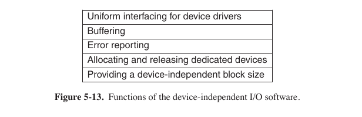

#### Task 1

Which of the following is **NOT** a general I/O approach?

Select one:

- ```Software-based I/O ``` <- **Correct, obviously**
- ```Programmed I/O```
- ```Interrupt-driven I/O```
- ```I/O using DMA```

---

#### Task 2

In which of the following four I/O software layers is computing
the ```track, sector and head for a disk read performed```?

Select one:

- ```User-level software```
- ```Device driver ``` <- **Correct**
- ```Device-independent software```
- ```Interrupt handlers```

> Many device drivers have a similar general structure. A typical driver starts out by checking the input parameters to see if they are valid. If not, an error is re- turned. If they are valid, a translation from abstract to concrete terms may be need- ed. For a disk driver, this may mean converting a linear block number into the head, track, sector, and cylinder numbers for the disk’s geometry.

5.3.2

---

#### Task 3

Which of the following are the typical functions of device-independent part of I/O software? Select all that apply

Select one or more:

- ```Uniform interfacing for device driving ```  <- **Correct**
- ```Error reporting on software level ```  <- **Correct**
- ```Allocating and releasing dedicated devices ``` <- **Correct**
- ```Interrupt handling``` <- This is separate layer
- ```Data encryption``` <- User space layer (by Tanenbaum)



---

#### Task 4

What is a precise interrupt?

Select one:

- ```An interrupt that has already been handled by the OS```
- ```An interrupt that leaves the machine in a well-defined state ``` <- **Correct**
- ```An interrupt that does not meet the requirements such as all instructions up to the program counter have completed and none of those beyond it have started```

> An interrupt that leaves the machine in a well-defined state is called a precise interrupt (Walker and Cragon, 1995). Such an interrupt has four properties:
> * The PC (Program Counter) is saved in a known place.
> * All instructions before the one pointed to by the PC have completed.
> * No instruction beyond the one pointed to by the PC has finished.
> * The execution state of the instruction pointed to by the PC is known.

349-350

---

#### Task 5

The busy waiting method for an I/O operation... Select all that are **TRUE**.

- ```It means that an I/O device is always busy and rarely waits``` <- _Bullshit_, it is not written in book
- ```It does not involve interrupts ``` <- **Correct**
- ```It has advantage, because it does not involve system calls``` Only kernel has access to I/O -> we need syscalls for
  it (1 lecture)
- ```It involves frequent polls and checks an I/O device status until the device finish an operation ``` <- **Correct**

> The mechanism is called **cycle stealing** because the device controller sneaks in and steals an occasional bus cycle from the CPU once in a while, delaying it slightly.

---

#### Task 6

Select the option which is **NOT** true regarding **Error Handling**:

Select one:

- ```If the controller discovers a read error, it should try to correct the error itself if it can.```
- ```Errors should be handled as far as possible of the hardware, preferably in the software layer. ``` <- **Correct**
- ```If the controller cannot correct the error itself, then the device driver should handle it.```
- ```In many cases, error recovery can be done transparently at a low level without the upper levels even knowing about the error```

> Another important issue for I/O software is error handling. **In general, errors should be handled as close to the hardware as possible**. If the controller discovers a read error, it should try to correct the error itself if it can. If it cannot, then the device driver should handle it, perhaps by just trying to read the block again. Many errors are transient, such as read errors caused by specks of dust on the read head, and will frequently go away if the operation is repeated. Only if the lower layers are not able to deal with the problem should the upper layers be told about it. **In many cases, error recovery can be done transparently at a low level without the upper levels even knowing about the error**.

351-352

---

#### Task 7

Comparing Asynchronous and Synchronous Transfers, it is right to affirm that:

Select one:

- ```After a read() system call, the program is automatically suspended until the data is available in the buffer (Synchronous Transfer) ``` <- **Correct**
- ```User programs are more complex to write if the I/O operations are blocking```
- ```Most physical I/O is Synchronous (Blocking)``` <- Asynchronous

> Still another important issue is that of synchronous (blocking) vs. asyn- chronous (interrupt-driven) transfers. Most physical I/O is asynchronous—the CPU starts the transfer and goes off to do something else until the interrupt arrives. **User programs are much easier to write if the I/O operations are blocking—after a read system call the program is automatically suspended** until the data are avail- able in the buffer. It is up to the operating system to make operations that are ac- tually interrupt-driven look blocking to the user programs. However, some very high-performance applications need to control all the details of the I/O, so some operating systems make asynchronous I/O available to them.

352

NB, open file synchronously in linux: ```fd = open("path", ...|O_SYNC)```

---

#### Task 8

Select the correct option(s) about **Programmed I/O**:

Select one or more:

- ```If a device is accessed via a serial interface and is currently in use by another process, calling it will fail and return an error code or will block until it is available``` <- **Correct**
- ```The CPU continuously polls the device to see if it is ready to accept data. This behavior is often called polling or busy waiting. ``` <- **Correct**
- ```It is the simplest form of I/O, as the CPU do all the work ``` <- **Correct**

> If the printer is currently in use by another process, this call will fail and return an error code or will block until the printer is available, depending on the operating system and the parameters of the call.

> Programmed I/O is simple but has the disadvantage of tying up the CPU full time until all the I/O is done. It checks to see if the printer is currently available. If not, it waits until it is. 
